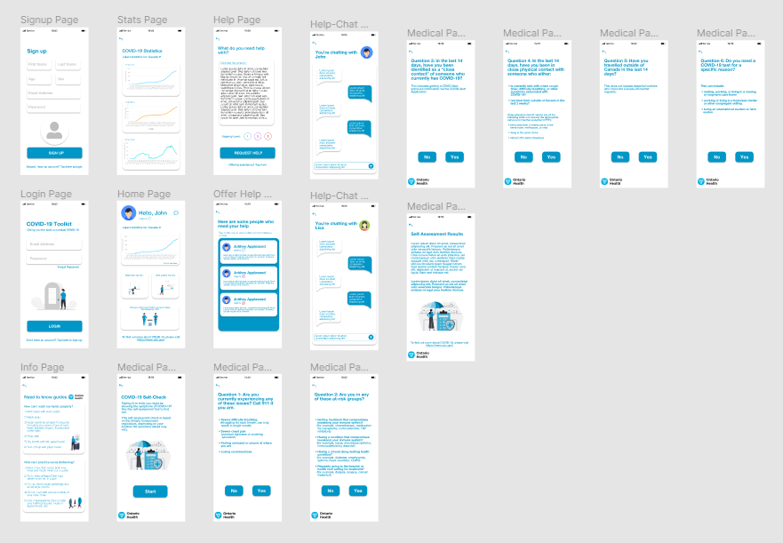

# Covid-19-Toolkit
Developed and designed for INFO31179 Human Computer Interaction

## 🦠 About
For people who are feel lost or unprepared on how to handle COVID, this application is for them! Covid-19 Toolkit was designed to help you equip yourself with the necessary tools and knowledge to combat COVID-19 and to understand what's going on in the world. This application provides a plethora of features which helps keep you up-to-date with the statistics, guidelines, and self-assessments for COVID-19.

## 🦠 Desireable Features
Because COVID-19 applies to every single person, the application needs to provide a universal set of features that make the application easy-to-use, while being informative at the same time. Here are 5 of the most desireable features.
  1. Good User Interface and User Experience
  2. Personalized Portfolio
  3. In Need / Offering Help Chat
  4. Universal Self-Assessment Check
  5. Universal Guides on COVID-19 Avoidance

## 🦠 Screenshots

## 🦠 Links
  1.  [Demo Video](https://youtu.be/9FVYHLEJWAE)
  2.  [FIGMA File](https://www.figma.com/file/M3V8dLsJ2wuEWHw4PhFRaW/Covid-19_Toolkit_A2)
